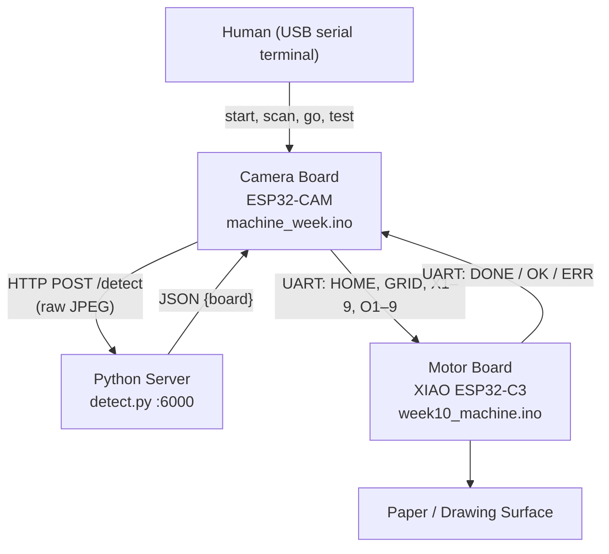
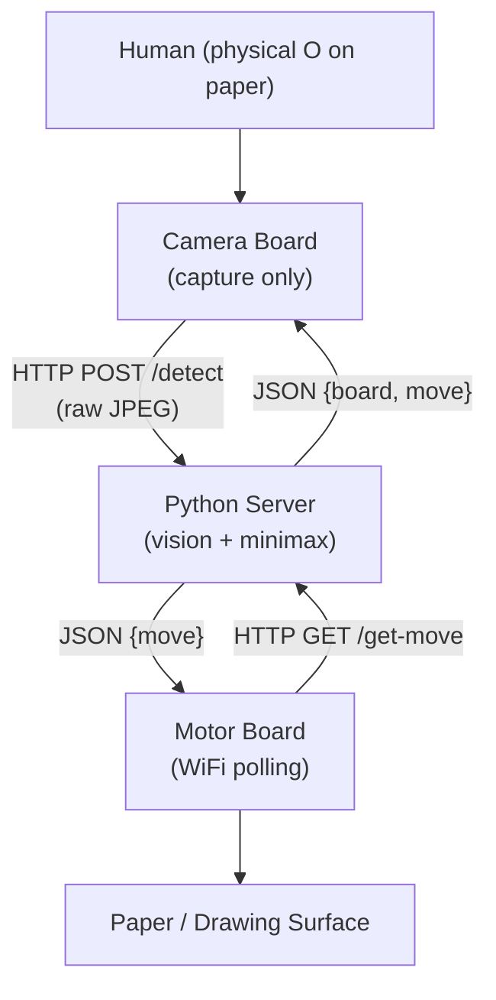

# Tic-Tac-Toe Robot — System Manual

Authoritative technical reference for the robot tic-tac-toe project. Describes the **current implementation** and flags deltas from the **intended** end-state architecture in §12. For user-facing quick start see [`README.md`](README.md).

---

## Table of Contents

1. [System Overview](#1-system-overview)
2. [Hardware & Wiring](#2-hardware--wiring)
3. [Communication Architecture](#3-communication-architecture)
4. [Component Specifications](#4-component-specifications)
   - [4.1 Camera Board](#41-camera-board--machine_weekmachine_weekino)
   - [4.2 Python Server](#42-python-server--detectpy)
   - [4.3 Motor Board](#43-motor-board--week10_machineweek10_machineino)
5. [API Reference — Flask Server](#5-api-reference--flask-server)
6. [UART Protocol — Camera ↔ Motor](#6-uart-protocol--camera--motor)
7. [Board State & Cell Numbering](#7-board-state--cell-numbering)
8. [Game Logic](#8-game-logic)
9. [Vision Pipeline](#9-vision-pipeline)
10. [Configuration Reference](#10-configuration-reference)
11. [Setup & Troubleshooting](#11-setup--troubleshooting)
12. [Known Issues & Planned Changes](#12-known-issues--planned-changes)
13. [Minimal Mental Model](#13-minimal-mental-model)

---

## 1. System Overview

A physical tic-tac-toe robot. A human competes against a robot that uses minimax. Three components cooperate:

| Component | Hardware | Source File |
|---|---|---|
| Camera Board | AI Thinker ESP32-CAM | [`machine_week/machine_week.ino`](machine_week/machine_week.ino) |
| Python Server | Laptop on local WiFi | [`detect.py`](detect.py) |
| Motor Board | Seeed XIAO ESP32-C3 | [`week10_machine/week10_machine.ino`](week10_machine/week10_machine.ino) |

**Mark assignment (as implemented):** Human plays **X**, robot plays **O**. _Note: there is a pending design change to flip this — see §12._

**Turn sequence (current implementation):**

1. Human types `start` on the camera board's USB serial → camera homes motor and draws grid.
2. Human draws an X on paper.
3. Human types `scan`.
4. Camera captures JPEG → HTTP POST to Python server → gets back the detected 3×3 board.
5. Camera validates exactly one new X and no lost O's, runs minimax, picks the robot's O cell.
6. Camera sends `O<n>` to motor board over UART → motor draws the O → replies `DONE`.
7. Repeat from step 2 until win or draw.

---

## 2. Hardware & Wiring

### Boards

| Board | Role |
|---|---|
| AI Thinker ESP32-CAM (OV2640) | Captures board images, orchestrates game, runs minimax |
| Seeed XIAO ESP32-C3 | Drives XY pen plotter, draws grid / X / O |

### Inter-board UART Wiring

```
Camera GPIO 14 (TX) ──────────────► Motor D10 / GPIO 10 (RX)
Camera GPIO 13 (RX) ◄────────────── Motor D6  / GPIO 21 (TX)
GND ◄──────────────────────────────► GND
```

Three wires. Both boards are 3.3 V, no level shifter needed. **9600 baud, 8N1.**

### Plotter Mechanics (Motor Board Pins)

| Axis / Element | Pin | Library |
|---|---|---|
| X step | D1 | AccelStepper DRIVER |
| X dir  | D5 | — |
| Y step | D3 | AccelStepper DRIVER |
| Y dir  | D2 | — |
| Pen servo | D4 | ESP32Servo (50 Hz, 500–2400 µs) |

- Pen up: 20°
- Pen down: 90°

---

## 3. Communication Architecture

### Current implementation



### Data flows at a glance

| Direction | Transport | Content |
|---|---|---|
| Human → Camera | USB serial (115200) | `start`, `scan`, `go`, `test` |
| Camera → Python | HTTP POST `/detect` | Raw JPEG bytes |
| Python → Camera | HTTP 200 JSON | `{"board": [...]}` |
| Camera → Motor | UART (9600) | `HOME`, `GRID`, `X1`–`X9`, `O1`–`O9`, `PING` |
| Motor → Camera | UART (9600) | `DONE`, `OK`, `ERR` |

The camera board is the orchestrator and the only node the human talks to. The motor board is a dumb executor.

See §12 for the intended future architecture where the motor polls the server directly and minimax moves to Python.

---

## 4. Component Specifications

### 4.1 Camera Board — `machine_week/machine_week.ino`

#### Responsibilities

- Initialize and configure the OV2640 camera sensor.
- Connect to WiFi; expose the stock ESP-IDF camera HTTP server ([`machine_week/app_httpd.cpp`](machine_week/app_httpd.cpp)).
- Accept game control commands over USB serial.
- Capture a JPEG on demand and POST it to the Python server.
- Parse the returned board JSON; validate the human's move.
- Run minimax and dispatch the draw command to the motor board over UART.

#### Camera Configuration

| Parameter | Value |
|---|---|
| Sensor | OV2640 |
| Format | `PIXFORMAT_JPEG` |
| Frame size | `FRAMESIZE_QVGA` (320×240) |
| JPEG quality | 12 (lower = better) |
| Frame buffer | PSRAM if available, DRAM otherwise |
| Grab mode | `GRAB_LATEST` when PSRAM present |
| Brightness / Contrast / Saturation | 0 / 1 / −1 |

#### Serial Commands (USB monitor, 115200 baud)

| Command | Behaviour |
|---|---|
| `start` | Clear board state; send `HOME` then `GRID` to motor; mark game active. |
| `scan` | Capture image → detect → validate move → run minimax → send draw command. |
| `go` | Capture and detect only. Print board. Does not play. (Debug.) |
| `test` | Print WiFi status and `serverUrl`. |

#### In-Firmware Board State

`char board[9]` — row-major, index = cell − 1. Values:

- `'.'` — empty
- `'X'` — human mark
- `'O'` — robot mark

This array is the source of truth for move validation.

#### Move Validation (`playOneTurn`)

1. Count cells where detected mark is `'X'` but stored mark is not → `newHuman`.
2. Count cells where stored mark is `'O'` but detected mark is not → `lostRobot`.
3. Reject if `lostRobot > 0` (vision error — existing robot mark disappeared).
4. Reject if `newHuman != 1` (human must add exactly one X).

On success, board is updated and minimax picks the robot's reply.

#### UART Motor Communication

Uses `HardwareSerial(2)` on UART2 (GPIO 14 TX, GPIO 13 RX). Commands are newline-terminated ASCII. The camera blocks up to **15000 ms** for a `DONE` or `OK` reply before timing out.

---

### 4.2 Python Server — `detect.py`

Runs on a laptop on the same WiFi as the camera board. Flask app on **port 6000**, bound to `0.0.0.0`.

#### `POST /detect`

Accepts a raw JPEG body (`Content-Type: image/jpeg`) from the camera.

**Processing pipeline:**

1. Decode JPEG with `cv2.imdecode`.
2. Run `detect_board(img)` → 3×3 list of `'.'`/`'X'`/`'O'`.
3. Save `latest.jpg` (last frame), `debug_grid.jpg` (grid overlay), and `images/cell_r{r}_c{c}.jpg` (per-cell crops).
4. Return JSON: `{"board": [[row0], [row1], [row2]]}`.

**Response (200):**

```json
{
  "board": [
    [".", "X", "."],
    [".", ".", "."],
    [".", ".", "."]
  ]
}
```

**Error responses:**

| Condition | Status | Body |
|---|---|---|
| No image in request | 400 | `{"error": "no image received"}` |
| OpenCV decode failure | 400 | `{"error": "could not decode image"}` |
| Grid detection failure | 400 | `{"error": "Could not detect 2 vertical and 2 horizontal inner grid lines"}` |

No other endpoints currently exist. (`GET /get-move` is planned — see §12.)

---

### 4.3 Motor Board — `week10_machine/week10_machine.ino`

#### Responsibilities

- Drive two stepper motors (X, Y) and a pen-lift servo.
- Receive draw commands over UART from the camera board.
- Accept the same commands over USB serial for bench testing without the camera.

#### Coordinate System

All positions are in stepper motor steps.

| Constant | Value | Meaning |
|---|---|---|
| `boardOriginX` | 500 | Left edge of grid (steps from home) |
| `boardOriginY` | 500 | Top edge of grid (steps from home) |
| `cellSize` | 1500 | Side length of one cell |
| `inset` | 220 | Padding inside a cell when drawing X or O |
| `yDownSign` | −1 | Y axis direction (−1 = away from home) |

Home `(0, 0)` is set manually before each game by jogging and sending `H`.

#### `setup()`

Initialises steppers (`maxSpeed` 600 steps/s, `accel` 300 steps/s²), attaches servo, initialises UART. **Does not draw the grid** — that is triggered by `GRID`.

#### `loop()`

Monitors two `Stream` sources in parallel:

1. `CamSerial` — UART from camera (primary).
2. `Serial` — USB (bench testing).

Both use the same `handleCommand(cmd, src)` and the reply is sent back to whichever source issued the command.

#### Drawing Routines

| Routine | Description |
|---|---|
| `drawGrid()` | Two horizontal + two vertical lines. |
| `drawX(pos)` | Two diagonal strokes inside cell `pos`. |
| `drawO(pos)` | 8-point polygon approximating a circle inside cell `pos`. |
| `lineTo(x1,y1,x2,y2)` | Pen-up → move to start → pen-down → move to end → pen-up. |
| `moveTo(x,y)` | Simultaneous XY move using AccelStepper (blocking). |

#### Bench-Test Commands (USB serial only)

| Command | Effect |
|---|---|
| `H` | Set current position as home (no movement). |
| `U` / `D` | Pen up / pen down. |
| `XR` / `XL` | Jog X +/- `jogStep`. |
| `YU` / `YD` | Jog Y +/- `jogStep`. |

These also work over UART if sent from the camera, but the camera never sends them in normal operation.

---

## 5. API Reference — Flask Server

Base URL: `http://192.168.0.160:6000` (update `serverUrl` in `machine_week.ino` if the laptop's IP changes).

| Method | Path | Auth | Description |
|---|---|---|---|
| POST | `/detect` | None | Submit board image; receive detected 3×3 board state. |

### `POST /detect` — Request

```
POST /detect HTTP/1.1
Content-Type: image/jpeg

<raw JPEG bytes>
```

### `POST /detect` — Response 200

```json
{
  "board": [
    [".", ".", "."],
    [".", ".", "."],
    [".", ".", "."]
  ]
}
```

`board[row][col]` where row 0 is the top row, col 0 is the leftmost column. Each cell is `"."`, `"X"`, or `"O"`.

---

## 6. UART Protocol — Camera ↔ Motor

**9600 baud, 8N1.** Newline-terminated ASCII.

### Commands (Camera → Motor)

| Command | Reply | Action |
|---|---|---|
| `HOME` | `DONE` | Pen up, move steppers to `(0, 0)`. |
| `GRID` | `DONE` | Draw the full tic-tac-toe grid. |
| `X1` – `X9` | `DONE` | Draw X in the specified cell. |
| `O1` – `O9` | `DONE` | Draw O in the specified cell. |
| `PING` | `OK` | Heartbeat. |
| _(unknown)_ | `ERR` | Command not recognised. |

### Timeout

Camera waits up to **15000 ms** for `DONE` or `OK`. On timeout the camera logs and continues.

---

## 7. Board State & Cell Numbering

### Cell Index Map

Cells are numbered **1–9**, row-major:

```
┌───┬───┬───┐
│ 1 │ 2 │ 3 │
├───┼───┼───┤
│ 4 │ 5 │ 6 │
├───┼───┼───┤
│ 7 │ 8 │ 9 │
└───┴───┴───┘
```

### Array Representations

- **Camera board:** `char board[9]` (0-indexed, index = cell − 1).
- **Python server:** 3×3 nested list `board[row][col]`, row 0 = top.

### Mark Values

| Symbol | Meaning |
|---|---|
| `'.'` | Empty cell |
| `'X'` | Human mark |
| `'O'` | Robot mark |

---

## 8. Game Logic

### Turn Order

- **Human moves first.** Draws an X.
- The robot responds with an O after each validated human move.
- Continues until winner or draw.

### Win Condition

Eight winning lines are checked after each move:

```
Rows:      [0,1,2]  [3,4,5]  [6,7,8]
Cols:      [0,3,6]  [1,4,7]  [2,5,8]
Diagonals: [0,4,8]  [2,4,6]
```

A winner is declared when all three cells in any line share the same non-empty mark.

### Minimax

Full-depth minimax (the 9-cell search space is trivially small, so no pruning is needed):

```
score(robot wins at depth d) = 10 − d    (prefer faster wins)
score(human wins at depth d) = d − 10    (prefer slower losses)
score(draw)                  = 0
```

Robot maximises; human assumed to minimise.

Implemented in `machine_week.ino` today. Planned to move into `detect.py` — see §12.

---

## 9. Vision Pipeline

### Grid Detection (`detect_board`)

1. **Grayscale + blur** (BGR → gray, 5×5 Gaussian).
2. **Binary inversion** — Otsu threshold with `THRESH_BINARY_INV` (dark ink → white on black).
3. **Morphological extraction** — `MORPH_OPEN` with `(w/8 × 1)` horizontal and `(1 × h/8)` vertical rectangular kernels.
4. **Row/column projection** — sum non-zero pixels per axis to find candidate line positions.
5. **Clustering** (`_cluster_positions`) — merge candidates within `max(8, dim/40)` and take the group mean.
6. **Inner-line selection** (`_pick_two_inner_lines`) — pick the pair whose midpoint is closest to image center, rejecting pairs spaced less than 12% of image dimension.
7. **Boundary inference** (`_infer_boundaries_from_inner_lines`) — extrapolate one cell-width outward to get 4 X-coordinates and 4 Y-coordinates.
8. **Cell extraction** — crop each of the 9 cells with 10% inset padding. Save `images/cell_r{r}_c{c}.jpg` and `debug_grid.jpg`.

### Cell Classification (`_classify_cell`)

Each cropped cell is classified as `'.'`, `'O'`, or `'X'`:

1. Grayscale + blur + Otsu (inverted).
2. Compute `ink_ratio` (non-zero / total). If `< 0.06` → `'.'`.
3. Find contours with `RETR_CCOMP` (to detect holes).
4. Keep contours whose area ≥ 8% of the ROI.

**O score (per significant contour):**

| Feature | Threshold | Score |
|---|---|---|
| Circularity `4πA/P²` | 0.65–1.15 | +1.2 |
| Aspect ratio (w/h) | 0.8–1.2 | +1.0 |
| Contour has interior hole | — | +1.6 |
| Ring-to-center ratio | > 0.16 | +1.4 |
| Ring-to-center ratio | > 0.24 | +0.8 additional |

**X score (diagonal sampling):**

| Feature | Threshold | Score |
|---|---|---|
| Diagonal ↘ ink ratio | > 0.42 | +1.2 |
| Diagonal ↗ ink ratio | > 0.42 | +1.2 |
| Both diagonals simultaneously | > 0.52 each | +1.2 |
| Center-box ink ratio | > 0.22 | +0.6 |

**Decision:**

- `'O'` if `O_score ≥ 3.8` and `O_score ≥ X_score + 0.9`
- `'X'` if `X_score ≥ 3.2` and `X_score ≥ O_score + 0.7`
- `'.'` otherwise

---

## 10. Configuration Reference

### Network (`machine_week/machine_week.ino`)

| Constant | Default | Description |
|---|---|---|
| `ssid` | `"MAKERSPACE"` | WiFi network name |
| `password` | `"12345678"` | WiFi password |
| `serverUrl` | `"http://192.168.0.160:6000/detect"` | Python server endpoint |

### Camera UART (`machine_week/machine_week.ino`)

| Constant | Value | Description |
|---|---|---|
| `MOTOR_TX_PIN` | GPIO 14 | Camera UART TX to motor |
| `MOTOR_RX_PIN` | GPIO 13 | Camera UART RX from motor |
| `MOTOR_BAUD` | 9600 | UART baud rate |

### Motor Board (`week10_machine/week10_machine.ino`)

| Constant | Value | Description |
|---|---|---|
| `CAM_RX_PIN` | D10 / GPIO 10 | Motor UART RX from camera |
| `CAM_TX_PIN` | D6 / GPIO 21 | Motor UART TX to camera |
| `CAM_BAUD` | 9600 | UART baud rate |
| `maxSpeed` | 600.0 | Stepper max speed (steps/s) |
| `accel` | 300.0 | Stepper acceleration (steps/s²) |
| `penUpPos` | 20° | Servo angle (pen up) |
| `penDownPos` | 90° | Servo angle (pen down) |
| `boardOriginX` | 500 | Grid left edge (steps from home) |
| `boardOriginY` | 500 | Grid top edge (steps from home) |
| `cellSize` | 1500 | One cell width/height (steps) |
| `inset` | 220 | Stroke padding inside a cell |
| `jogStep` | 500 | Manual jog increment |

### Python Server (`detect.py`)

| Setting | Value | Description |
|---|---|---|
| Host | `0.0.0.0` | Listens on all interfaces |
| Port | `6000` | HTTP port |

---

## 11. Setup & Troubleshooting

### Laptop

```bash
pip install -r requirements.txt    # flask, opencv-python
python detect.py                   # binds 0.0.0.0:6000
```

The laptop's LAN IP must match `serverUrl` in `machine_week.ino`.

### Camera Board (AI Thinker ESP32-CAM)

1. Arduino IDE → Preferences → Additional Boards Manager URLs:
   `https://raw.githubusercontent.com/espressif/arduino-esp32/gh-pages/package_esp32_index.json`
2. Boards Manager → install **esp32 by Espressif Systems** (provides `esp_camera.h`).
3. Open `machine_week/machine_week.ino`.
4. Tools → Board → ESP32 Arduino → **AI Thinker ESP32-CAM**.
5. Tools → Partition Scheme → **Huge APP (3MB No OTA/1MB SPIFFS)**.
6. Flash with **IO0 pulled to GND** (release after upload).

### Motor Board (XIAO ESP32-C3)

1. Manage Libraries → install **AccelStepper** (Mike McCauley) and **ESP32Servo** (Kevin Harrington).
2. Open `week10_machine/week10_machine.ino`.
3. Tools → Board → ESP32 Arduino → **XIAO_ESP32C3**.
4. Flash normally.

### Wiring

Three wires per §2: camera GPIO 14 → motor D10, camera GPIO 13 → motor D6, common GND.

### Homing the Plotter

1. Open motor board USB serial monitor at 115200.
2. Jog to the desired top-left corner with `XR`/`XL`/`YU`/`YD`.
3. Type `H` to lock that position as origin.

### Gotchas

| Symptom | Cause / Fix |
|---|---|
| `esp_camera.h: No such file` | ESP32 board package not installed, or wrong board selected. |
| `board_config.h: No such file` | Arduino IDE is compiling the wrong folder. Companion headers must be in the same folder as the `.ino`. |
| Sketch can't be opened | `.ino` filename must equal folder name (e.g. `foo/foo.ino`). |
| Both sketches compile together with duplicate `setup()`/`loop()` | Two `.ino` files in the same folder — keep each sketch in its own subfolder. |
| Detection returns garbage | Check lighting. Inspect `latest.jpg`, `debug_grid.jpg`, and `images/cell_r*_c*.jpg`. Server prints per-cell scores to stdout. |
| UART timeout | Check wiring: GND, TX↔RX crossed (not straight-through). Bench-test by sending `PING` and looking for `OK`. |
| AI Thinker upload fails | IO0 must be tied to GND during upload. Release after "Connecting..." appears. |
| Flask port 6000 blocked on macOS / Chrome | Port 6000 is considered unsafe. Change the port in `detect.py` and `serverUrl` together (e.g. 5001). |

---

## 12. Known Issues & Planned Changes

The **current implementation** is camera-orchestrated: the camera board pulls the board state from Python and pushes draw commands to the motor over UART. The **intended end-state** is a simpler pipeline where Python is the single source of game intelligence and the motor polls Python over WiFi.

### Planned Architecture (target)



### Outstanding Items

| Issue | File(s) | Status |
|---|---|---|
| `ROBOT_MARK = 'O'` and `HUMAN_MARK = 'X'` in code — may need to swap so robot=X, human=O | `machine_week.ino:33-34` | Design decision — currently code and README agree (human=X, robot=O). Flip if the design is human=O, robot=X. |
| Minimax lives on the camera board; should move to `detect.py` so the server is the single source of game intelligence | `machine_week.ino`, `detect.py` | Planned refactor |
| `choose_move` in `detect.py` (once added) needs a real minimax, not a first-empty placeholder | `detect.py` | Not implemented |
| `GET /get-move` endpoint doesn't exist; motor can't poll | `detect.py` | Not implemented |
| Motor board has no WiFi / HTTP client code | `week10_machine.ino` | Not implemented |
| When `/get-move` exists, current UART-based command path from camera becomes redundant | `machine_week.ino`, `week10_machine.ino` | Planned removal |
| Game loop is driven by manual `start` / `scan` commands; could be timer-driven auto-scan | `machine_week.ino` | Design decision pending |

Any AI or collaborator working on this project should treat §1–§11 as the current reality and §12 as the roadmap.

---

## 13. Minimal Mental Model

> Camera board runs the game today. It photographs the paper, asks a laptop Flask server to read the board, runs minimax locally, and tells a motor board what to draw over a 3-wire UART. The target design moves game logic to the Python server and has the motor poll the server over WiFi — but none of that is built yet. Both ESP32 sketches live in their own subfolders (`machine_week/` for camera, `week10_machine/` for motor) because Arduino IDE requires the `.ino` name to match its folder.
