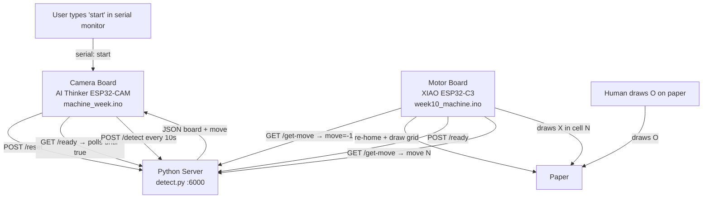

# Tic-Tac-Toe Robot — System Specification

---

## Overview

A two-board ESP32 system that plays tic-tac-toe against a human, mediated by a Python server. All communication between hardware components goes through the shared Python server over WiFi — there is no direct wiring between the two boards.

- **Human** plays **O** by drawing on paper.
- **Robot** plays **X** by driving a pen plotter.

A game is started by typing `start` into the camera board's USB serial monitor, which resets server state, triggers the motor board to re-home and redraw the grid, and then enables scanning once the motor signals it is ready.

---

## Components

| Component | Hardware | Source File |
|---|---|---|
| Camera board | AI Thinker ESP32-CAM | [`machine_week/machine_week.ino`](machine_week/machine_week.ino) |
| Python server | Laptop on local WiFi | [`detect.py`](detect.py) |
| Motor board | Seeed XIAO ESP32-C3 | [`week10_machine/week10_machine.ino`](week10_machine/week10_machine.ino) |

---

## System Architecture

Both ESP32 boards connect independently to the same WiFi network and communicate exclusively with the Python server over HTTP.



### Data Flows

| From | To | Endpoint | Content |
|---|---|---|---|
| Camera board | Python server | `POST /reset` | `{}` — resets game state, signals motor to redraw |
| Camera board | Python server | `GET /ready` | polls until `{"ready": true}` |
| Camera board | Python server | `POST /detect` | Raw JPEG bytes (every 10 s while game active) |
| Python server | Camera board | HTTP 200 JSON | `{"board": [...], "move": N}` |
| Motor board | Python server | `GET /get-move` | polls every 2 s |
| Python server | Motor board | HTTP 200 JSON | `{"move": N}` — `-1` = redraw, `0` = idle, `1`–`9` = draw X |
| Motor board | Python server | `POST /ready` | `{}` — signals grid is drawn and game can begin |

---

## Component Specifications

### 1. Camera Board — `machine_week/machine_week.ino`

The camera board runs a loop that photographs the board every 10 seconds and sends the image to the Python server for processing.

**Hardware:** AI Thinker ESP32-CAM with OV2640 sensor.

| Camera setting | Value |
|---|---|
| Format | JPEG |
| Resolution | QVGA (320×240) |
| JPEG quality | 12 |
| Frame buffer | PSRAM when available, DRAM otherwise |

**WiFi:** Connects to `MAKERSPACE` (password `12345678`). Also starts the ESP-IDF camera HTTP server via [`machine_week/app_httpd.cpp`](machine_week/app_httpd.cpp).

**Starting a game:**

Type `start` into the USB serial monitor. The camera board will:
1. POST `/reset` to the Python server (clears game state, sets the reset-pending flag).
2. Poll `GET /ready` every 3 seconds (up to 2 minutes) until the motor board signals it has finished drawing the grid.
3. Once ready is confirmed, enable the 10-second scan loop and print `"Game started"`.

**Loop behaviour (while game is active):**

Every 10 seconds, the camera:
1. Captures a JPEG frame (`esp_camera_fb_get`).
2. POSTs the raw bytes to `http://192.168.0.160:6000/detect`.
3. Parses the JSON response to read back the updated board state and logs it.

The camera board does **not** decide game moves and does **not** communicate with the motor board directly. Its only jobs are to trigger resets and to photograph and forward images.

**Board state (local copy):**

A `char board[9]` array tracks the last known board for display purposes (`.` empty, `X` robot, `O` human, index 0–8 maps to cells 1–9 row-major).

---

### 2. Python Server — `detect.py`

A Flask app running on a laptop at port 6000. It is the sole source of game state and game intelligence. Both boards talk only to this server.

**App state:**

| Variable | Type | Meaning |
|---|---|---|
| `current_move` | `int \| None` | Most recent computed robot move (1–9), or `None` |
| `previous_board` | `list \| None` | Last accepted board state used for move validation |
| `reset_pending` | `bool` | Set by `/reset`; causes `/get-move` to return `-1` once |
| `motor_ready` | `bool` | Set by motor's `POST /ready`; cleared by `/reset` |

---

#### `POST /detect`

Called by the camera board every time it takes a photo.

**Request:** Raw JPEG bytes, `Content-Type: image/jpeg`.

**Processing:**

1. Decode the JPEG with OpenCV.
2. Run `detect_board(img)` to parse the 3×3 grid into a board state.
3. Validate the human's move:
   - Count O marks on the new board vs. the previous board.
   - **Accept only if exactly 1 new O was added to a previously empty cell.**
   - If the move is invalid (0 new O's, 2+ new O's, or a previously filled cell was changed), take no action and return the current board as-is.
4. If the move is valid: call `choose_move(board)` to find the best X position, save it to the server's state variable.
5. Return JSON.

**Response:**

```json
{
  "board": [[".", "O", "."], [".", "X", "."], [".", ".", "."]],
  "move": 7
}
```

`move` is the 1-indexed cell number chosen for X, or `null` if no move was computed this turn.

**Errors:**

| Condition | Status | Body |
|---|---|---|
| No image data | 400 | `{"error": "no image received"}` |
| JPEG decode failure | 400 | `{"error": "could not decode image"}` |
| Grid not found | 400 | `{"error": "Could not detect 2 vertical and 2 horizontal inner grid lines"}` |

---

#### `GET /get-move`

Polled by the motor board every 2 seconds.

**Response:**

```json
{ "move": 5 }
```

| `move` value | Meaning |
|---|---|
| `-1` | Reset signal — re-home, redraw grid, then POST `/ready`. Served once then clears. |
| `0` | Idle — no pending move |
| `1`–`9` | Draw X in that cell |

#### `POST /reset`

Called by the camera board when the user types `start`. Clears `current_move`, `previous_board`, sets `reset_pending = True` and `motor_ready = False`.

**Request:** `{}` · **Response:** `{"status": "ok"}`

#### `POST /ready`

Called by the motor board after it finishes re-homing and drawing the grid.

**Request:** `{}` · **Response:** `{"status": "ok"}`

#### `GET /ready`

Polled by the camera board (every 3 s, up to 2 min) while waiting for the grid to be drawn.

**Response:** `{"ready": true}` or `{"ready": false}`

---

### 3. Motor Board — `week10_machine/week10_machine.ino`

Controls an XY pen plotter with a pen-lift servo. Draws the tic-tac-toe grid on startup, then polls the Python server and draws the robot's X moves as they come in.

**Hardware:** Seeed XIAO ESP32-C3.

| Axis | Step pin | Dir pin |
|---|---|---|
| X | D1 | D5 |
| Y | D3 | D2 |

Pen servo: **D4**, 50 Hz, 500–2400 µs range.
- Pen up: 20°
- Pen down: 90°

**Coordinate system** (all values in stepper steps):

| Constant | Value | Meaning |
|---|---|---|
| `boardOriginX` | 500 | Left edge of grid from home |
| `boardOriginY` | 500 | Top edge of grid from home |
| `cellSize` | 1500 | Side length of one cell |
| `inset` | 220 | Stroke padding inside each cell |
| `yDownSign` | -1 | Y direction away from home |

Home `(0, 0)` is set manually before each game by jogging the plotter and sending `H`.

**`setup()`:**

Initialises steppers (max speed 600 steps/s, acceleration 300 steps/s²), attaches the servo, connects to WiFi, draws the initial tic-tac-toe grid, then begins polling.

**`loop()`:**

Polls `GET /get-move` every 2 seconds:

| Returned `move` | Action |
|---|---|
| `-1` | Pen up → move to `(0,0)` → `drawGrid()` → `POST /ready` → reset `lastMove` |
| `0` | Idle — do nothing |
| Same as `lastMove` | Do nothing |
| New value `1`–`9` | `drawX(move)` → update `lastMove` |

The motor board also listens on USB serial so draw commands (`GRID`, `X1`–`X9`, `HOME`, `H`, `U`, `D`, `XR`, `XL`, `YU`, `YD`) can be sent manually for bench testing.

---

## Board State & Cell Numbering

Cells are numbered **1–9**, row-major:

```
┌───┬───┬───┐
│ 1 │ 2 │ 3 │
├───┼───┼───┤
│ 4 │ 5 │ 6 │
├───┼───┼───┤
│ 7 │ 8 │ 9 │
└───┴───┴───┘
```

Cell values: `.` empty · `O` human · `X` robot.

The Python server represents the board as a 3×3 nested JSON array (`board[row][col]`, row 0 = top). The camera board stores it as a flat `char board[9]` (index = cell − 1).

---

## Game Logic

**Turn order:** Human always moves first by drawing an O.

**Validation (enforced by `detect.py` `/detect`):**

- The new board must contain exactly 1 more O than the previous board.
- No existing mark (X or O) may be removed or changed.
- If validation fails, the server ignores the frame and waits for the next scan.

**Robot move selection (`choose_move`):**

The server picks the best available cell for X. The intended algorithm is minimax (exhaustive, no depth limit):

```
score(robot wins at depth d) = 10 - d   ← prefer faster wins
score(human wins at depth d) = d - 10   ← prefer slower losses
score(draw)                  = 0
```

The robot maximises its score; the human is assumed to minimise it.

**Win detection:**

Eight winning lines checked after every move:

```
Rows:      [1,2,3]  [4,5,6]  [7,8,9]
Cols:      [1,4,7]  [2,5,8]  [3,6,9]
Diagonals: [1,5,9]  [3,5,7]
```

---

## Vision Pipeline (`detect.py`)

### Grid Detection (`detect_board`)

1. Convert BGR → grayscale, apply 5×5 Gaussian blur.
2. Otsu threshold with `THRESH_BINARY_INV` (dark grid lines become white on black).
3. Morphological `MORPH_OPEN` with a wide horizontal kernel (`w/8 × 1`) and a tall vertical kernel (`1 × h/8`) to isolate horizontal and vertical lines separately.
4. Project each line image onto its axis (sum non-zero pixels per row / per column).
5. Cluster nearby peaks (`_cluster_positions`, gap threshold `max(8, dim/40)`) → list of candidate line positions.
6. From all candidates, pick the two inner lines whose midpoint is closest to the image centre (`_pick_two_inner_lines`); reject pairs spaced less than 12% of the image dimension.
7. Extrapolate one cell-width outward from each inner line to get the outer boundaries (`_infer_boundaries_from_inner_lines`) — yielding 4 X boundaries and 4 Y boundaries.
8. Crop all 9 cells (with 10% inset padding). Save each to `images/cell_rR_cC.jpg`. Save a debug overlay to `debug_grid.jpg`.

### Cell Classification (`_classify_cell`)

1. Grayscale + blur + Otsu invert.
2. `ink_ratio` = non-zero pixels / total pixels. If < 0.06 → `"."`.
3. Find contours with `RETR_CCOMP` (captures interior holes). Keep only contours with area ≥ 8% of the ROI.

**O score** — scored per large contour, best score kept:

| Feature | Condition | Points |
|---|---|---|
| Circularity `4πA/P²` | 0.65 – 1.15 | +1.2 |
| Aspect ratio w/h | 0.8 – 1.2 | +1.0 |
| Has interior hole | — | +1.6 |
| Ring pixel density vs. centre | > 0.16 | +1.4 |
| Ring pixel density vs. centre | > 0.24 | +0.8 |

**X score** — sampled along both diagonals of the ROI:

| Feature | Condition | Points |
|---|---|---|
| Diagonal ↘ ink ratio | > 0.42 | +1.2 |
| Diagonal ↗ ink ratio | > 0.42 | +1.2 |
| Both diagonals simultaneously | > 0.52 each | +1.2 |
| Centre box ink ratio | > 0.22 | +0.6 |

**Decision:**
- `"O"` if `O_score ≥ 3.8` and `O_score ≥ X_score + 0.9`
- `"X"` if `X_score ≥ 3.2` and `X_score ≥ O_score + 0.7`
- `"."` otherwise

---

## Configuration

### Camera Board (`machine_week/machine_week.ino`)

| Constant | Value |
|---|---|
| `ssid` | `"MAKERSPACE"` |
| `password` | `"12345678"` |
| `serverUrl` | `"http://192.168.0.160:6000/detect"` |

### Motor Board (`week10_machine/week10_machine.ino`)

| Constant | Value |
|---|---|
| `maxSpeed` | 600.0 steps/s |
| `accel` | 300.0 steps/s² |
| `penUpPos` | 20° |
| `penDownPos` | 90° |
| `boardOriginX` | 500 steps |
| `boardOriginY` | 500 steps |
| `cellSize` | 1500 steps |
| `inset` | 220 steps |
| `jogStep` | 500 steps |

### Python Server (`detect.py`)

| Setting | Value |
|---|---|
| Host | `0.0.0.0` |
| Port | `6000` |

---

## Configuration

### Camera Board (`machine_week/machine_week.ino`)

| Constant | Value |
|---|---|
| `ssid` | `"MAKERSPACE"` |
| `password` | `"12345678"` |
| `serverUrl` | `"http://192.168.0.160:6000/detect"` |
| `resetUrl` | `"http://192.168.0.160:6000/reset"` |
| `readyUrl` | `"http://192.168.0.160:6000/ready"` |
| `SCAN_INTERVAL_MS` | 10 000 ms |
| `READY_POLL_MS` | 3 000 ms |
| `READY_TIMEOUT_MS` | 120 000 ms |

### Motor Board (`week10_machine/week10_machine.ino`)

| Constant | Value |
|---|---|
| `getMoveUrl` | `"http://192.168.0.160:6000/get-move"` |
| `readyUrl` | `"http://192.168.0.160:6000/ready"` |
| `POLL_INTERVAL_MS` | 2 000 ms |
| `maxSpeed` | 600.0 steps/s |
| `accel` | 300.0 steps/s² |
| `penUpPos` | 20° |
| `penDownPos` | 90° |
| `boardOriginX` | 500 steps |
| `boardOriginY` | 500 steps |
| `cellSize` | 1500 steps |
| `inset` | 220 steps |
| `jogStep` | 500 steps |

### Python Server (`detect.py`)

| Setting | Value |
|---|---|
| Host | `0.0.0.0` |
| Port | `6000` |
